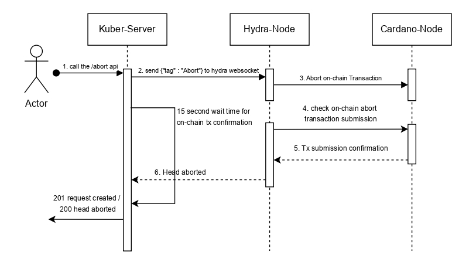

Aborting a Hydra head is a process initiated on the mainchain during the setup phase if the head initialization fails. This failure typically occurs when not all head members successfully post their commit transactions to lock their UTxOs into the head. A party can then post an abort transaction on the mainchain. This transaction transitions the mainchain state machine directly from the initial state to the final state, bypassing the open and closed states. The abort transaction ensures that any UTxOs that were successfully committed are returned to the mainchain and that the head's unique participation tokens are burned, effectively cancelling the head creation and cleaning up the onchain state.

