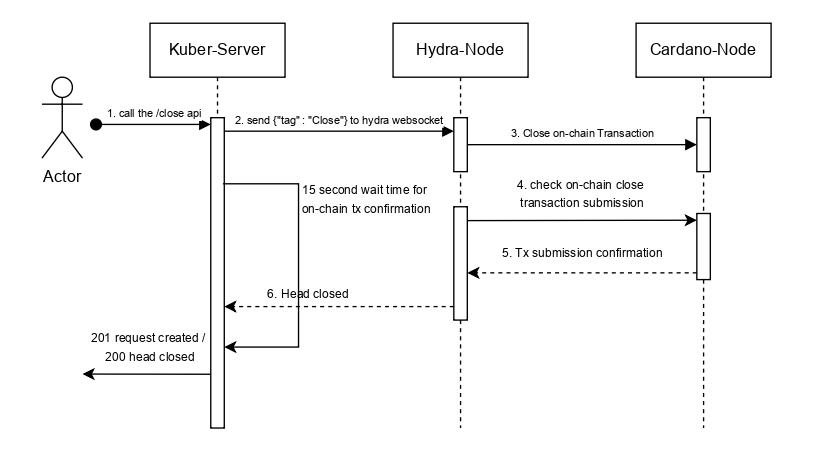

Closing a Hydra head means terminating the offchain state channel and settling the final agreed-upon state back onto the mainchain. This process is typically initiated by a head member posting a close transaction on the mainchain, which transitions the mainchain state machine from the open state to the closed state. This transaction includes a certificate representing that party's view of the latest confirmed offchain state.

