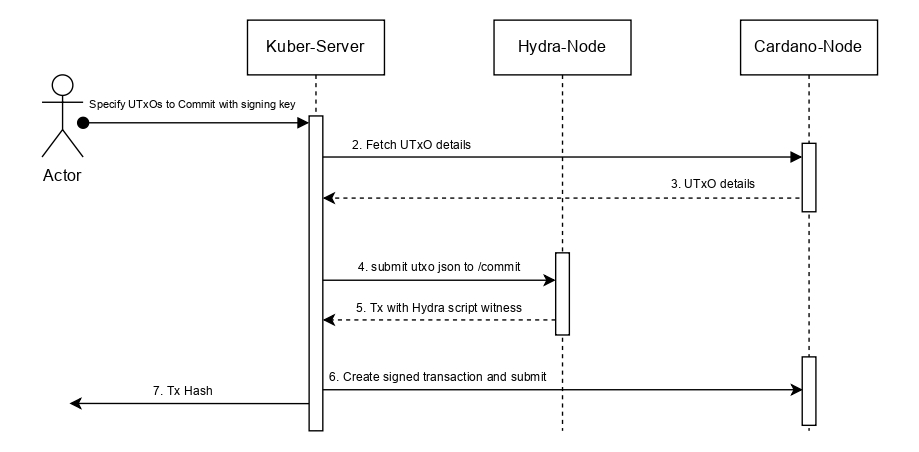

Each member locks their chosen UTxOs onchain by posting a commit transaction, utilizing their participation token. Finally, a collectCom transaction is posted to aggregate all committed UTxOs into the initial head state and transition the mainchain state machine to the "open" state, enabling offchain processing to commence.

