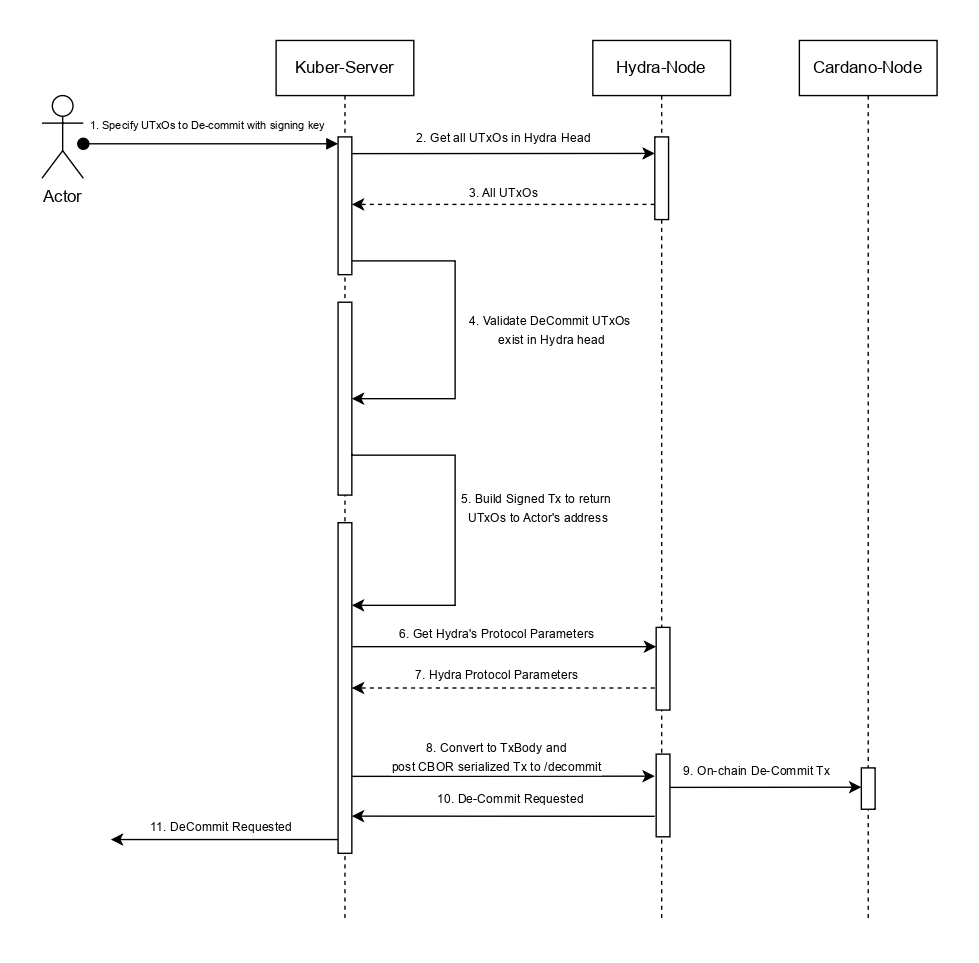

Decommitting a UTxO in Hydra means moving it out of the offchain head protocol and back onto the mainchain. This effectively makes the funds or state represented by that UTxO available for standard layer-one operations again. Decommitment can occur when the head is closed, settling the final set of UTxOs back onchain, or incrementally while the head remains open, allowing specific UTxOs to be removed without closing the entire head.

