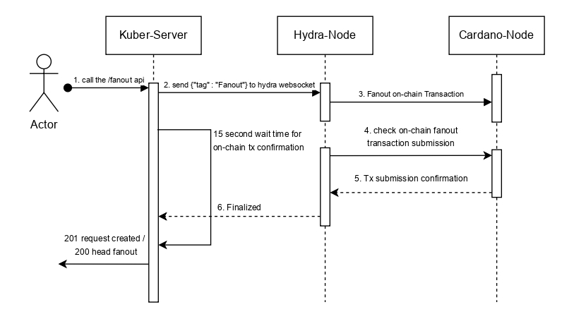

Finally, after the contestation period, a fanout transaction transitions the state machine to the final state, placing the definitive set of UTxOs from the head back onto the mainchain, effectively replacing the initial set that was committed.

