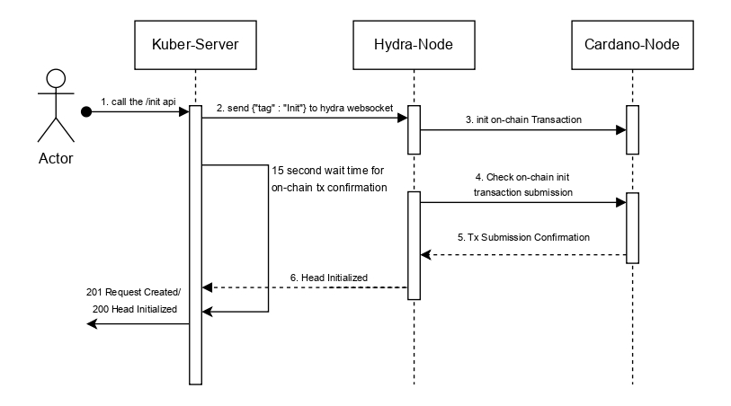

Initialization of a Hydra head is the process of setting up the offchain state channel for a group of parties. It begins with an initiator posting an initial transaction on the mainchain, which defines the head members and parameters, and forges unique participation tokens for each member.

