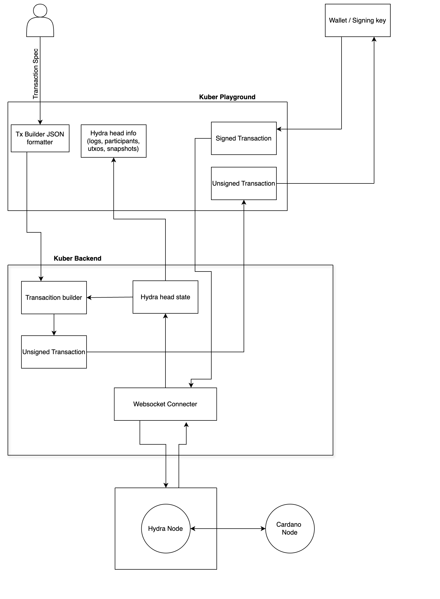
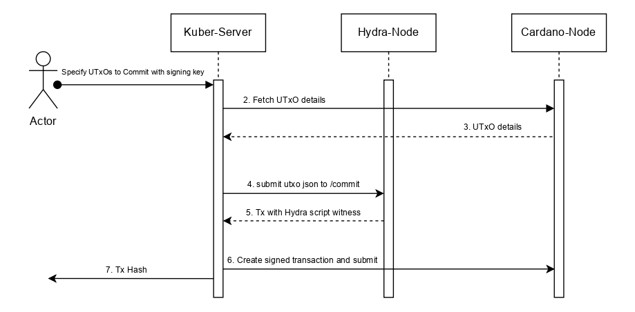
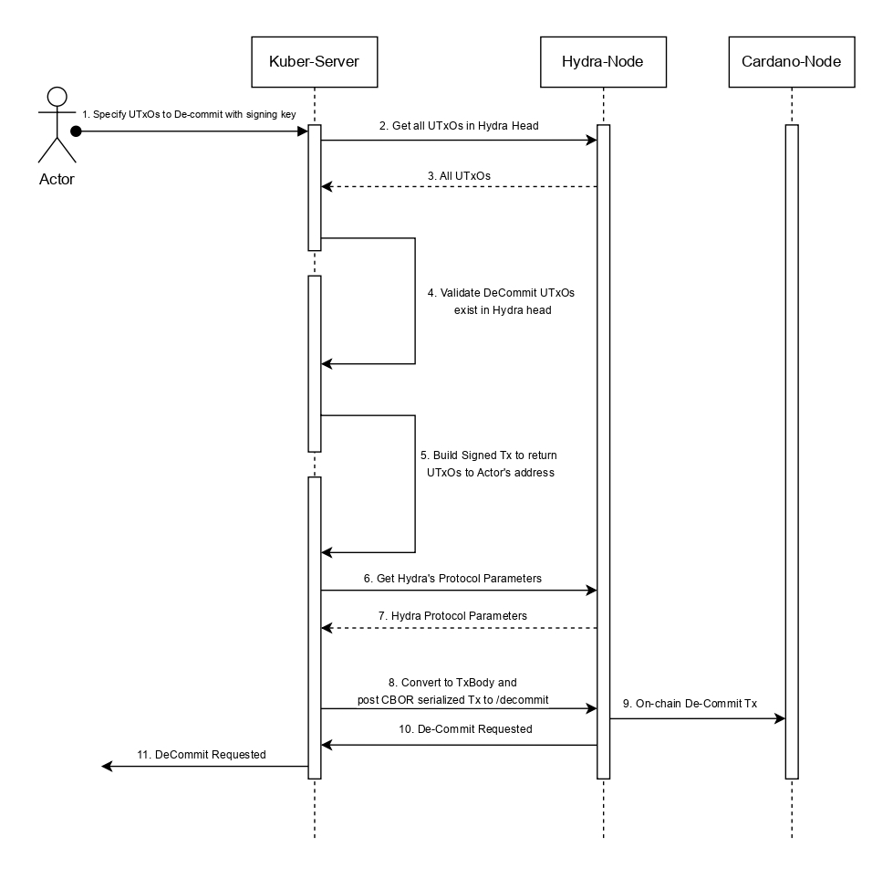
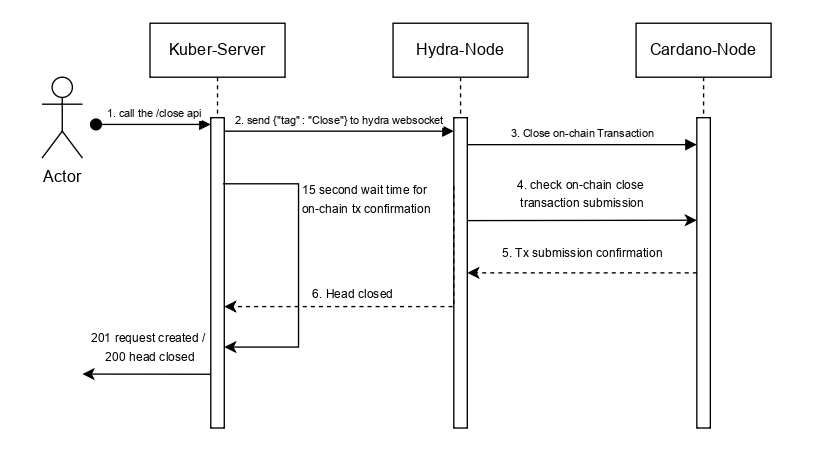
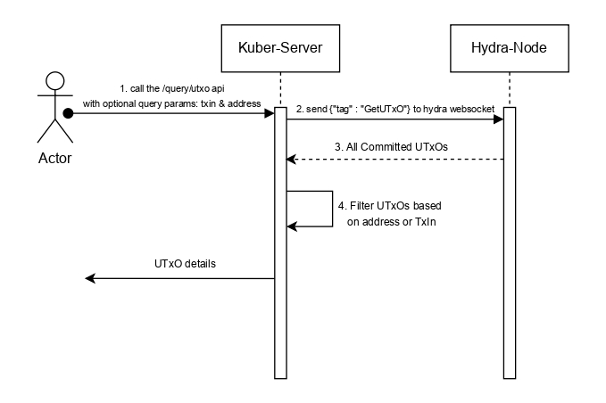
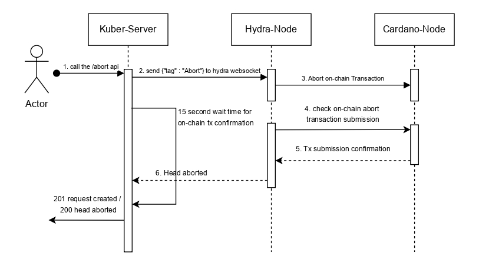
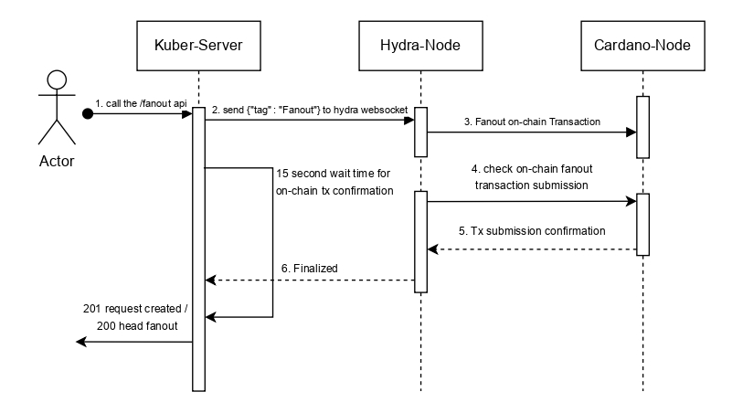

# Project Technical Details

## APIs / JSON RPC to Implement

### 🔎 Query API

-   `queryUtxosByAddress`: Retrieve UTXOs owned by a specific address within a Hydra Head.
-   `queryUtxosByTxIn`: Retrieve UTXO information using a specific transaction hash and / or index.
-   `queryProtocolParameters`: Return hydra protocol parameters used while initializing the hydra node.
-   `queryHydraState`: Retrieve current state of a Hydra Head (phases include: `Idle`, `Initial`, `Open`, `Closed`, `Fanout`).

### 🏗 Transaction Build API

-   Accept JSON-based transaction definitions as input.
-   Construct transactions according to Kuber’s transaction specification, modified to work with Hydra protocol parameters.
-   Automatically handle fee balancing and validation.
-   Support submission and reporting of success or error messages (e.g., invalid transaction structure).

### 🔁 Hydra Relay API

-   `initializeHead`: Start a new Hydra Head.
-   `commitUtxos`: Add UTXOs to the Hydra Head.
-   `decommitUtxos`: Withdraw UTXOs from the Hydra Head.
-   `closeHead`: Signal intent to close the Hydra Head.
-   `contestHead`: Contest the Hydra Head after closing and before fanout.
-   `abortHead`: Abort the Head in case of failure or deadlock.
-   `fanoutTransaction`: Submit the final fanout transaction after Head closure.

These APIs will be exposed as REST endpoints and integrated with a WebSocket backend to provide real-time feedback to users.

----------

## Technical Architecture

A draft diagram is available [here](https://raw.githubusercontent.com/drep-id/image/main/preview/kuber-hydra_20250417075127614.png).  

### 🧭 High-Level Overview

The architecture illustrates how the **Kuber backend** interfaces with a **Hydra node** to enable the construction and submission of transactions within a Hydra Head. It also includes developer tooling such as the **Kuber Playground**, and various internal components for formatting, building, and communicating via WebSocket.

### 🧱 Components & Flows

#### 1. **Kuber Playground**
- A frontend or client library for experimenting with Kuber APIs.
- Construct and Send **Transaction JSON** (in a Kuber-native-json format) to the backend for processing.
- Connects with browser wallet.

#### 2. **Kuber Backend**
The heart of the architecture, composed of several interconnected subcomponents:

#### a. **Transaction JSON**
- The input from users (via Playground or API calls).
- Defines what UTxOs to use, where to send funds, metadata, etc.

#### b. **JSON Formatter / Tx Builder**
- Parses the incoming JSON into a transaction skeleton.
- Constructs a **valid unsigned transaction** using Hydra’s protocol parameters.
- Ensures all required data (like fee calculation, input/output balancing) is handled automatically.

#### c. **Hydra Head State / Info**
- Internally tracked by the backend.
- Includes:
    - Current phase (e.g., idle, open, closed)
    - Participants
    - UTXOs available in the Head
    - Snapshots (state of UTXO set at different points)

#### d. **Hydra Head State → Transaction Builder**
- The **transaction builder** consumes the current Hydra head state to determine:
    - Which UTXOs are available
    - Who the valid participants are
    - Which constraints apply to the transaction

This ensures that the transaction being built is **valid within the Hydra Head context**, not just on Layer 1.

#### e. **Unsigned Transaction**
- After JSON processing and validation against the Hydra head state, an unsigned transaction is created and passed downstream for signing.

#### f. **Wallet / Signing Key**
- External or embedded component used to **sign** the transaction.
- May use local signing keys or delegate to an external wallet provider.

#### g. **Signed Transaction**
- The completed transaction ready to be submitted to the Hydra node.

#### 3. **WebSocket Connector**
- A critical module for real-time communication with the **Hydra Node**.
- Establishes a **WebSocket connection** using the provided **IP and port** (configurable by the user).
- Allows:
    - Submitting signed transactions
    - Receiving real-time Hydra head updates
    - Listening to participant activity, state changes, and log events

#### 4. **Hydra Node**
- A running instance of the Hydra protocol node.
- Works in conjunction with a Cardano Layer 1 node for finality and chain interaction.
- Accepts:
    - **WebSocket messages** for control commands and transaction submission
- Provides:
    - Real-time updates on head state, snapshots, participant actions, and UTXO changes

### 🔄 Key Data Flows

| Source               | Destination        | Description                                                                 |
|----------------------|--------------------|-----------------------------------------------------------------------------|
| Playground           | Kuber Backend       | Sends raw transaction request in JSON                                       |
| JSON Formatter       | Tx Builder          | Converts JSON into internal format for construction                         |
| Hydra Head State     | Tx Builder          | Feeds contextual info like UTXOs and participants                           |
| Tx Builder           | Wallet/Signer       | Passes unsigned transaction to be signed                                    |
| Wallet               | WebSocket Connector | Passes signed transaction for broadcast                                     |
| Kuber WS Connector   | Hydra Node          | Communicates via WebSocket: transaction submission & state queries/responses|

This architecture supports a fully interactive development and production environment where:
- Users define transactions via a JSON interface (API or playground).
- Kuber formats, validates, and constructs transactions using Hydra context.
- Transactions are signed and submitted over WebSocket to a Hydra node.
- The system maintains a mirrored view of Hydra state and simplifies all interactions for the user.

### Sequence Diagrams
#### Initialize Head
  

#### Commit UTxOs  
  

#### DeCommit UTxOs
  

#### Close Head 
  

#### Query UTxOs 
  

#### Abort Head
  

#### Fanout Head
  

### Components Overview

-   **Kuber Server (Haskell, Cabal)**:

    -   Handles JSON input for transaction requests.
    -   Builds transactions using Hydra protocol parameters.
    -   Relays transactions and commands to Hydra nodes.

-   **Hydra Node**:

    -   Managed by the user.
    -   Listens for WebSocket commands and responds with state updates.

-   **Kuber WebSocket Proxy**:

    -   Connects to the Hydra node WebSocket.
    -   Translates and structures messages into Kuber-native JSON.
    -   Enables clients to subscribe to transaction statuses and state updates.
